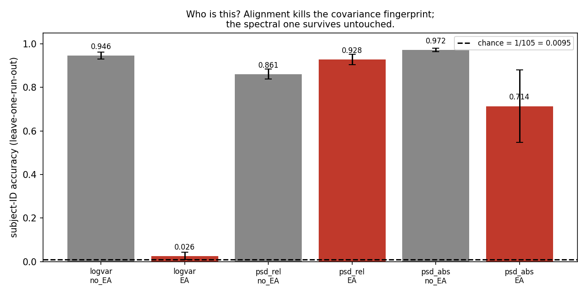

# Decoding imagined left vs right fist movement from EEG

NT@B FA26 Software Division recruitment project.

**Headline: cross-subject imagery decoding reaches 0.695 on a person the model
has never seen. On the same preprocessed data, the machine identifies *which of
106 people* it is with 92.6% accuracy against a 1-in-106 chance level — and the
alignment method recommended as standard preprocessing for cross-subject models
removes only half of that fingerprint.**

---

## Quick start

```bash
python -m venv .venv && source .venv/bin/activate
pip install -r requirements.txt
./scripts/fetch.sh 109 "3 4 7 8 11 12" 8     # download the data (~15 min)
```

### Predict from a raw EDF

```bash
python scripts/predict.py --edf ~/mne_data/MNE-eegbci-data/files/eegmmidb/1.0.0/S105/S105R04.edf
```

Prints one predicted label per trial. **Subjects S101–S109 were deliberately held
out of the shipped model**, so those are genuinely unseen — S103 scores 0.800 and
S107 scores 0.933 on 15 trials each.

The CLI applies the identical preprocessing chain, then Euclidean Alignment using
**only that file's own trials** — legitimate because alignment is unsupervised. It
warns if handed a run outside {3,4,7,8,11,12}, refuses recordings at the wrong
sampling rate, and fails with a readable message rather than a traceback.

### Reproduce the results

```bash
python scripts/eval_predict.py      --subjects 109    # R1
python scripts/leakage.py           --subjects 109    # R2
python scripts/baseline_and_fit.py  --subjects 109    # R3, R5
python scripts/probe_both.py        --subjects 109    # R4
python scripts/transfer.py          --subjects 109    # R6
python scripts/where_is_signal.py   --subjects 109    # R7
python scripts/figures.py
```

---

## The pipeline

```
raw EDF (64 channels, 160 Hz)
  → bandpass 8–30 Hz          mu + beta, where the effect lives
  → common average reference  remove shared noise
  → epoch 0.5–3.5 s post-cue  skip the visual response to the cue
  → Euclidean Alignment       per subject, unsupervised
  → CSP (4 spatial filters) → shrinkage LDA
  → leave-one-subject-out over 106 subjects
```

**8–30 Hz** because motor cortex oscillates there, and imagining a movement
desynchronises it so band power drops contralaterally. Outside that band there is
no effect to find. It also removes 60 Hz line noise and sub-4 Hz drift — which is
most of the eye-blink energy, and why there is no ICA step.

**Euclidean Alignment** normalises each subject against their own data, so a
model trained on others transfers. It uses no labels, which is what makes it
legitimate on a stranger's file.

**Four CSP components** compresses each trial from 30,720 numbers to 4. Sweeping
2/4/6/8 was flat (0.528 / 0.534 / 0.541 / 0.541), so the smallest workable choice
was kept.

**106 subjects** — all usable ones. The commonly published exclusion list is
S088/S089/S092/S100; only three are actually broken (128 Hz, 5.12 s trials).
**S089 is fine** and was verified rather than inherited.

---

## Results

All at 106 subjects, imagined runs 4/8/12, leave-one-subject-out.

| | question | result |
|---|---|---|
| **R1** | What can the model do and not do? | **0.695** aligned · **0.598** unaligned · range 0.36–1.00 · 60/106 individually above chance |
| **R2** | Is the number an artifact of how I split? | **0.978 from a model that learned nothing** — +44.8 pp from window overlap, +2.3 pp from subject pooling |
| **R3** | What is the real baseline? | permutation null 95th pct **0.511**, observed 0.593, p = 0.005 |
| **R4** | Person or task? | identity **0.926** vs task **0.695**, chance 1/106 |
| **R5** | Learned or memorised? | CSP+LDA gap **0.5 pp**; 2080-feature model **28.9 pp** |
| **R6** | Does execution transfer to imagery? | 0.674, against 0.688 for imagery→imagery |
| **R7** | Is it really brain activity? | 9 motor channels 0.667 vs 11 frontal/occipital 0.568; refit at 30–70 Hz falls to 0.567 |

### The gap between the first number and the defended number

| | |
|---|---|
| overlapping windows shuffled into train/test | **0.978** |
| grouped by trial | 0.529 |
| grouped by subject | 0.507 |
| **my pipeline, leave-one-subject-out** | **0.695** |

A 1-nearest-neighbour classifier scores **0.978** by finding the window a quarter
second away from the same trial. **44.8 points of that is window overlap; only
2.3 points is subject pooling.** So the standard advice — use subject-wise splits
— is necessary and nowhere near sufficient.

### The finding

| | no alignment | after alignment |
|---|---|---|
| identity from covariance | 0.947 | **0.027** |
| **identity from spectral shape** | 0.865 | **0.926** |
| identity from absolute spectrum | 0.973 | 0.710 |

Alignment destroys one fingerprint and leaves the other untouched. It is a
*spatial* transform, so anything encoded in the *shape* of the frequency spectrum
passes through unchanged. The third row is the control confirming that mechanism:
absolute power drops because it includes scale, which alignment does normalise.
Replicated on the executed runs (0.827 → 0.905), so it is not an imagery artifact.




---

## Weakest point

R4 shows identity *survives* alignment. It does **not** show that surviving
identity is what caps task accuracy — those are different claims and only the
first was measured. The experiment that would close it is to strip the spectral
fingerprint and test whether accuracy rises.

The fingerprint could also be hardware rather than neurophysiology: electrode
impedance and amplifier gain differ per subject, and these recordings are
same-session with the same cap placement, so that cannot be ruled out here.
S089 records at roughly a third the amplitude of others — a concrete example.

---

## Layout

```
CORE.md            the five results, written up
EXPERIMENTS.md     attempt log, including what failed
src/               pipeline: data, preprocess, align, models, evaluate, probes
scripts/           one script per result, plus predict.py and train.py
results/           CSVs and figures
models/            the shipped model (trained on 97 subjects, S101–109 held out)
```

## References

Schalk et al., *IEEE TBME* 51(6):1034–1043, 2004 (BCI2000) · Goldberger et al.,
*Circulation* 101(23):e215–e220, 2000 (PhysioNet) · He & Wu, *IEEE TBME*
67(2):399–410, 2020 (Euclidean Alignment) · Junqueira et al., *J. Neural Eng.*
21(3):036038, 2024 (EA as standard cross-subject preprocessing) · Brookshire et
al., medRxiv 2024.01.16.24301366 (segment vs subject holdout)
