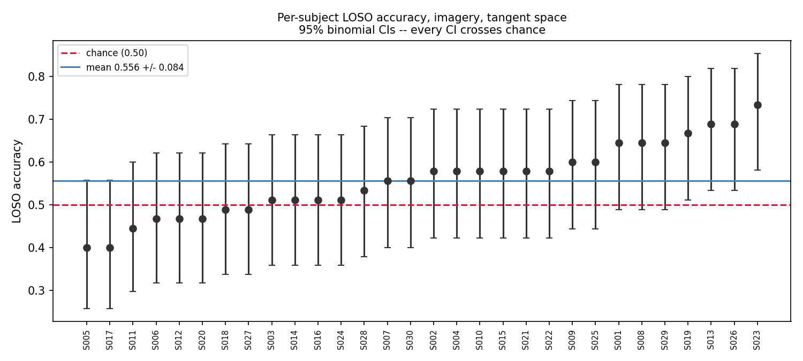
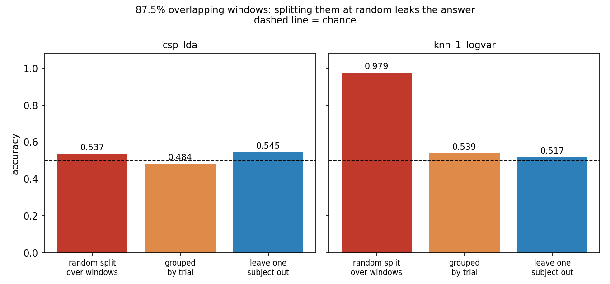
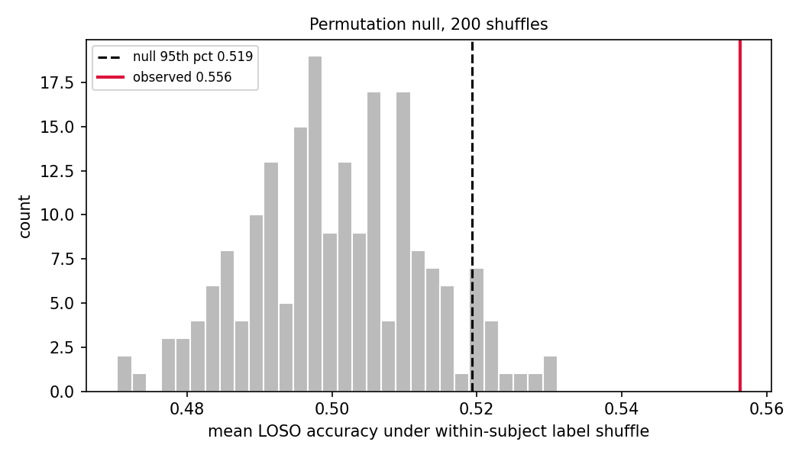
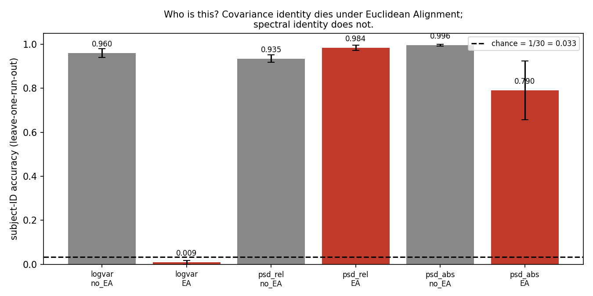
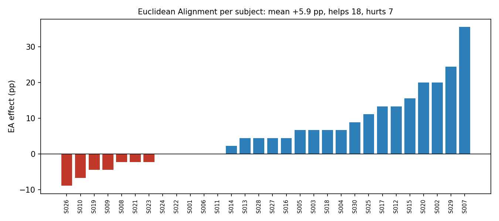
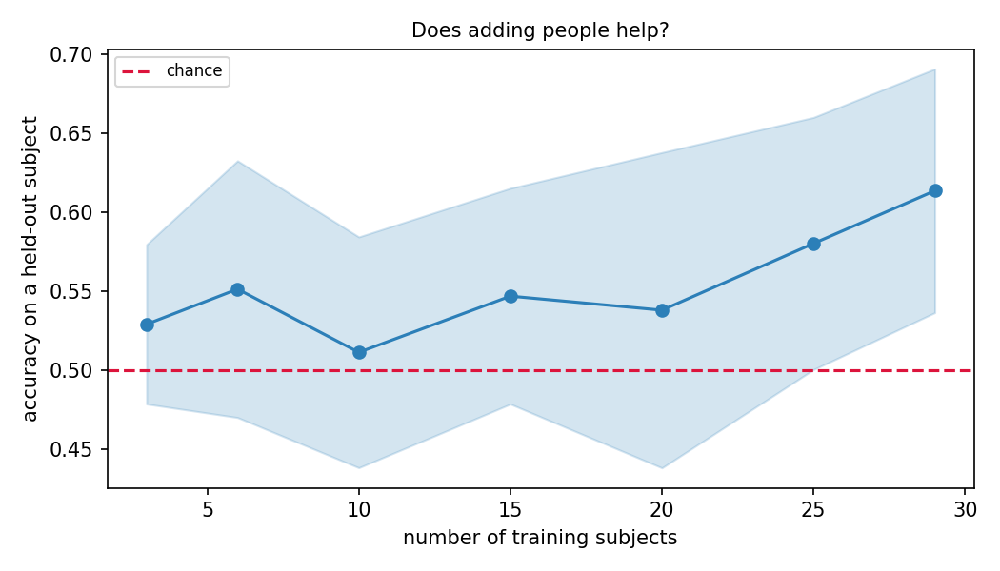

# Left vs right fist decoding on EEGMMIDB — and what the number actually means

NT@B FA26 Software Division recruitment project.

**Headline: cross-subject imagery decoding sits at ~0.61 and every individual
subject's confidence interval crosses chance. Meanwhile subject identity is
decodable from the same preprocessed data at 0.99 against a chance level of
0.033. Euclidean Alignment — recommended in the literature as standard
preprocessing for cross-subject models — destroys the covariance half of that
identity signal and leaves the spectral half completely untouched.**

That last sentence is the finding. Everything else is the evidence for it.

---

## Quick start

```bash
python -m venv .venv && source .venv/bin/activate
pip install -r requirements.txt

./scripts/fetch.sh 30 "3 4 7 8 11 12" 8   # ~6 min, parallel; optional but much faster
python scripts/verify_labels.py           # A1: check T1/T2 before trusting anything
python scripts/gonogo.py --subjects 15    # the four numbers that set the framing
python scripts/grid.py all --subjects 30  # the full experiment grid -> results/*.csv
python scripts/figures.py                 # -> results/*.png
```

### Prediction CLI

```bash
python scripts/train.py --subjects 30 --out models/csp_lda.joblib
python scripts/predict.py --edf ~/mne_data/MNE-eegbci-data/files/eegmmidb/1.0.0/S042/S042R04.edf
```

Prints one predicted label per trial. It applies the identical preprocessing
chain, then Euclidean Alignment computed from **only that file's own trials** —
legitimate because EA is unsupervised, and it is the only adaptation a real BCI
could perform before a new user has produced a single label. It warns if handed
a run outside {3,4,7,8,11,12}, refuses recordings at the wrong sampling rate, and
skips EA rather than estimating a whitener from fewer than four trials.

---

## The data, and what I checked before trusting it

PhysioNet EEGMMIDB: 109 subjects, 64 channels, 160 Hz, BCI2000. I used the first
30 subjects that pass QC. Thirty is enough for a LOSO estimate whose standard
error is small relative to the between-subject spread — that spread is ~0.09, so
30 subjects put the standard error near 0.016, and the conclusions here turn on
gaps of 5–40 points, not 2. More subjects buy download time, not resolution.

**Excluded by construction:** S088, S089, S092, S100 — nonstandard sampling rate
or trial duration, so their epochs come out the wrong shape.

Some published curations additionally drop S038, S104 and S106 for annotation
problems. These load cleanly here and stay in. **That different papers exclude
different subjects from the same public dataset, with no shared standard, is
itself worth noticing** — it is a small free parameter that moves reported
accuracies and is almost never stated in an abstract.

### The T1/T2 trap

The task description says the meaning of T1 and T2 depends on the run and tells
you to check. I checked, and the check has a sharper edge than expected:

| | T0 | T1 | T2 |
|---|---|---|---|
| runs 3/7/11 (L/R fist, executed) | 45 @ 4.1–4.2 s | 22–23 @ 4.10 s | 22–23 @ 4.10 s |
| runs 5/9/13 (fists/feet, executed) | 45 @ 4.1–4.2 s | 22–23 @ 4.10 s | 22–23 @ 4.10 s |

**The annotation structure is identical.** Counts, durations, cadence — there is
nothing inside the file that distinguishes "left fist vs right fist" from "both
fists vs both feet". Only the run number in the filename does. Mislabel this and
you get a trained model, a plausible accuracy, and no error message anywhere.

Because the filename is a weak thing to stake a project on, `verify_labels.py`
also checks the mapping physiologically: left- vs right-hand movement should
desynchronise mu over the *contralateral* hemisphere, so C3 and C4 should move in
opposite directions in the L/R fist runs. See A2 below — they do.

### Preprocessing

```
raw EDF (64ch, 160 Hz)
  -> eegbci.standardize()            strip trailing dots from channel names
  -> set_montage(standard_1005)
  -> bandpass 8-30 Hz, zero-phase FIR
  -> common average reference
  -> epoch 0.5-3.5 s post-cue
  -> [Euclidean Alignment]           per-subject, unsupervised, ablation switch
  -> CSP(4) -> shrinkage LDA   |  Covariances(oas) -> TangentSpace -> LogReg
  -> LeaveOneGroupOut(groups=subject)
```

- **8–30 Hz** is mu plus beta, where event-related desynchronisation lives.
  Outside that band there is no ERD to find. It also removes 60 Hz line noise and
  sub-4 Hz drift for free, which is most of the eye-blink energy — that is why
  there is no ICA step, and C2 below is the check on whether that was enough.
- **CAR** shrinks the between-subject magnitude differences a shared reference
  introduces, which matters for anything cross-subject.
- **0.5–3.5 s** skips the onset evoked transient and ends before the next trial.
- Filtering and CAR happen on **continuous** data, before epoching, so filter
  edge effects do not eat into the analysis window.
- Every model step — CSP, scalers, LDA, the tangent-space projection — is inside
  an `sklearn.Pipeline` and refit on each fold's training set only.

---

## How I decided what train and test share

This is the question the whole evaluation turns on, so it gets stated plainly.

**The split is leave-one-subject-out.** A model is trained on 29 people and
tested on the 30th, whose data it has never seen in any form. This matches the
deployment situation the brief describes: a new person sits down and the model
must work with zero labels from them.

Two other splits appear, both as reference points rather than results:

- **Random trial-level 5-fold** pools every trial from every subject and splits
  at random, so ~80% of the test subject's own trials are in training. This is
  the protocol much of the published literature uses and it is the wrong one.
- **Within-subject k-fold** trains and tests inside one person. That is the
  optimistic ceiling and it corresponds to a BCI that makes the user sit through
  a labelled calibration session first.

The subject-ID probes use a third split — **leave-one-run-out**. Every subject
necessarily appears in both train and test, because subject identity *is* the
label, but train and test trials come from different recording runs. Without
that, a high identity score would just mean two halves of one continuous
recording look alike.

---

## Results

30 subjects, imagined runs 4/8/12 unless stated. Every figure is
mean ± sd across held-out subjects, never a bare mean.

### A. Does the physiological effect exist at all?

**A2 — contralateral ERD.** Mu-band (8–13 Hz) power at C3 and C4, right-hand
trials minus left-hand trials. The lateralisation index is defined so that
positive = the expected contralateral pattern.

| paradigm | lateralisation index | t (vs 0) | p | subjects with expected sign |
|---|---|---|---|---|
| imagined | **+0.203 ± 0.266** | +4.12 | 0.0003 | 24 / 30 |
| executed | **+0.149 ± 0.299** | +2.68 | 0.012 | 19 / 30 |

The effect is real at the group level and in the right direction, which
independently confirms the T1/T2 mapping — a mislabelled dataset would not
produce a *lateralised* difference. Two things to notice. First, six subjects
show the **reverse** pattern for imagery; the effect is a group property, not a
per-person guarantee. Second, the effect is *stronger for imagery than for
execution*, which is backwards from the usual "execution has a stronger signal"
claim. C3 below explains why.

**A3/A4 — the optimistic ceiling, and why single-subject numbers are nearly
meaningless.** Stratified 5-fold *inside* each subject:

| pipeline | within-subject accuracy | range | mean 95% CI width |
|---|---|---|---|
| csp_lda | 0.547 ± 0.183 | 0.27 – 1.00 | 27.9 pp |
| tangent_space | 0.567 ± 0.181 | 0.27 – 0.98 | 28.0 pp |

With ~45 trials per subject, a single subject's accuracy carries a 95% binomial
confidence interval roughly 28 points wide. One subject scores 1.00 and another
0.27; both are consistent with the same underlying ability. **Any per-subject
number in this dataset, mine or anyone else's, is nearly uninformative on its
own.** This is why every table here reports a distribution.

### What the shipped model can and cannot do

`predict.py` is handed a single EDF, so it must estimate the Euclidean Alignment
whitener from that one run's ~15 trials. Training aligns per subject across three
runs. That is a train/test mismatch, and quoting the grid's LOSO number as if it
described the CLI would be quietly wrong, so it gets measured directly
(`scripts/eval_predict.py`, 30 subjects, leave-one-subject-out, csp_lda):

| test-time alignment | accuracy | range | per-subject CIs crossing chance |
|---|---|---|---|
| **per-run EA** — what `predict.py` actually does | **0.658 ± 0.165** | 0.38 – 1.00 | 14 / 30 |
| per-subject EA — what training assumes | 0.641 ± 0.147 | 0.36 – 0.96 | 15 / 30 |
| **no alignment at test time** | **0.512 ± 0.030** | 0.47 – 0.64 | 30 / 30 |

Three things a skeptical reader should take from this table.

**The mismatch is benign.** Aligning on one run is not worse than aligning on
three — it is marginally better, probably because a single run is more
homogeneous than three runs pooled. Worth measuring rather than assuming.

**Essentially all of the cross-subject capability is the alignment, not the
classifier.** Feed the same trained model unaligned data and it drops to 0.512
with a standard deviation of 0.03 — indistinguishable from chance for every
single subject. The classifier alone does not transfer across people at all.

**The number is a group statistic and nothing more.** The range runs 0.38 to
1.00 and roughly half the subjects individually have confidence intervals that
include chance. Two genuinely held-out subjects illustrate the point: S031
scores 0.867 and S032 scores 1.000 on 15 trials each, and neither is evidence of
anything — a 15-trial estimate carries a ~±25 pp interval. This is why the CLI
prints that caveat alongside its own accuracy.

**Honest caveat about "zero calibration".** EA on a new subject is transductive:
it needs a batch of that person's trials before the whitener can be estimated.
Those trials are *unlabelled*, which is a far lighter burden than a labelled
calibration session, but it is not zero. A truly online system would need to
estimate the whitener incrementally, and I have not tested that.



### B. Is the number an artifact of how I split the data?

The headline honest number, leave-one-subject-out on imagery:

| pipeline | random 5-fold (wrong) | **LOSO (honest)** | gap |
|---|---|---|---|
| csp_lda | 0.541 | 0.534 ± 0.058 | +0.7 pp |
| tangent_space | 0.619 | **0.556 ± 0.084** | +6.3 pp |

**I predicted a 15–30 point gap and did not get one.** That prediction is
falsified and the explanation is more interesting than the prediction was.

My first hypothesis was capacity: a linear model fit globally across pooled
subjects cannot exploit knowing who the test subject is, because subject
identity carries no information about the left/right label — every subject
contributes both classes in balance. So I built a capacity ladder over one
shared feature space (B4):

| model | random 5-fold | LOSO | gap |
|---|---|---|---|
| logistic regression | 0.619 | 0.556 | +6.3 pp |
| RBF SVM | 0.604 | 0.590 | +1.4 pp |
| 1-NN | 0.516 | 0.505 | +1.0 pp |

**That hypothesis is falsified too.** Capacity did not widen the gap — 1-NN has
the *narrowest* gap, because 1-NN in a 2080-dimensional tangent space is at
chance under both protocols and a model that cannot memorise usefully cannot
leak.

So where does the published inflation come from? Not from pooling subjects. The
answer is **windowing** (B5, `scripts/leakage.py`). Many EEG pipelines cut each
trial into several overlapping windows to multiply their sample count, then
split those windows at random. Two windows from the same trial that overlap by
87.5% are very nearly the same data, so the test set is full of near-duplicates
of training rows. Rebuilding exactly that setup — 1350 trials → 6750 windows,
2.0 s wide, 0.25 s apart:

| split | csp_lda | **1-NN on log-variance** |
|---|---|---|
| random 5-fold over **windows** | 0.537 | **0.979** |
| 5-fold grouped by **trial** | 0.484 | 0.539 |
| leave-one-**subject**-out | 0.545 | 0.517 |
| **window leakage** | +5.3 pp | **+44.0 pp** |
| **subject leakage** | −6.1 pp | +2.2 pp |

**0.979 from a model that has learned nothing about motor imagery.** Its nearest
neighbour is simply the window 0.25 s away, from the same trial, sitting in the
training set. That single number reproduces the 84–89% range reported in the
literature for this dataset, and it decomposes cleanly: 44 points of it are
window overlap, 2 points are subject pooling.

The practical consequence is that the much-repeated advice "use subject-wise
splits" is necessary but nowhere near sufficient. Grouping by subject *and*
splitting windows at random still gives you 0.979. You have to group by trial.



### C. Baselines beyond chance

**C1 — permutation null.** Labels shuffled *within* each subject, then the
entire LOSO rerun, 200 times. Within-subject shuffling matters: a global shuffle
would also destroy each subject's class balance and make the null easier than
the real problem.

| | value |
|---|---|
| null mean | 0.501 |
| null 95th percentile | 0.519 |
| null maximum over 200 shuffles | 0.531 |
| **observed** | **0.556** |
| **p** | **0.005** |

The result clears its own null, but note how tight the null is: the honest 0.556
sits only 3.7 points above the 95th percentile. Chance is 0.50, but the number
that matters for "is this real" is 0.519, not 0.50.

**C2 — channel ablation.** Is the signal where sensorimotor physiology says it
should be?

| channels | accuracy |
|---|---|
| motor only (C3/Cz/C4 + neighbours, 9 ch) | **0.580 ± 0.106** |
| all 64 | 0.556 ± 0.084 |
| non-motor only (frontal + occipital, 11 ch) | 0.521 ± 0.071 |

Non-motor channels drop toward chance, which is the expected result and an
argument that blinks and drift are not carrying the classification. Note also
that **9 motor channels beat all 64** — more input is worse here, which is the
same over-parameterisation story F1 tells below.

**C3 — the EMG control.** Muscle activity is broadband and sits closer to the
scalp electrodes than cortex does, so it contaminates beta. If executed-run
accuracy holds up in a band where there is no ERD to find, then part of
execution's famous "stronger signal" is muscle rather than brain. Refit the
entire pipeline at 30–70 Hz:

| paradigm | 8–30 Hz (ERD band) | 30–70 Hz (no ERD) | drop |
|---|---|---|---|
| imagined | 0.556 ± 0.084 | 0.526 ± 0.053 | −3.0 pp → near chance |
| executed | 0.625 ± 0.098 | **0.559 ± 0.077** | −6.6 pp → still decodable |

Imagery collapses toward chance outside the ERD band, which is what it should do
if what it is decoding is cortical. Execution does not: at 30–70 Hz it still
scores 0.559, which is as high as imagery's *best* band. **Some of execution's
advantage is not cortical.** This is the concrete reason imagery is the honest
target here, and it is why I did not simply report the easier executed number.



### D. Person or task? — the centrepiece

Subject-ID probes, leave-one-run-out, 30 subjects, **chance = 1/30 = 0.033**,
run on exactly the same preprocessed epochs the task classifier sees.

| features | no alignment | **after Euclidean Alignment** |
|---|---|---|
| log-variance (covariance) | 0.960 ± 0.020 | **0.009 ± 0.010** |
| **relative log-PSD (spectral shape)** | 0.935 ± 0.017 | **0.984 ± 0.012** |
| absolute log-PSD | 0.996 ± 0.004 | 0.790 ± 0.133 |

**The finding: Euclidean Alignment destroys the covariance fingerprint entirely
and leaves the spectral fingerprint completely intact.** 0.960 → 0.009 in one
row; 0.935 → 0.984 in the next. Task accuracy over the same data is 0.556.

The mechanism is not mysterious, and the third row is the check on it. EA
applies `X̃ = R^(-1/2) X`, a linear *spatial* transform that is constant over
time. Every output channel is a fixed linear combination of the input channels'
time series, so anything that lives in the *shape* of the spectrum, shared
across channels, passes through unchanged. What EA does normalise is overall
power — which is exactly why absolute log-PSD, which confounds shape with
scale, drops from 0.996 to 0.790 while relative log-PSD does not move. The
prediction and its control both hold.

Two details that make this a claim about people rather than about recordings:
the probe is **leave-one-run-out**, so the fingerprint has to generalise across
recording sessions; and D2 lands at 0.009, *below* the 0.033 chance level, so
after alignment subjects are not merely unidentifiable but systematically
mis-identified across runs.

**So: aligning covariances is not a control for subject identity.** A method a
*Journal of Neural Engineering* systematic evaluation recommends as a standard
preprocessing step for cross-subject models leaves a near-perfect subject
signature in the data it hands to the classifier.



**D5/D6 — what EA actually buys, and who it hurts.**

| pipeline | mean EA effect | helped | hurt |
|---|---|---|---|
| csp_lda | **+10.7 pp ± 13.0** | 22 / 30 | 7 / 30 |
| tangent_space | +5.9 pp ± 9.7 | 18 / 30 | 7 / 30 |

EA helps considerably more than the 0–8 pp I expected. But the standard
deviation is larger than the mean effect in both pipelines, and **7 subjects out
of 30 are made worse in both**. Negative transfer is real and reporting only the
mean would hide it.

There is a tension worth stating plainly rather than smoothing over: EA is the
single most useful thing in this pipeline (+10.7 pp, and without it the shipped
model is at chance), *and* it leaves a perfect subject fingerprint behind. Both
are true. It is a good method that is not doing the thing its name suggests it
does.



### E. Transfer between execution and imagery

| direction | accuracy | range |
|---|---|---|
| E1 train executed → test imagined | **0.577 ± 0.107** | 0.38 – 0.84 |
| E2 train imagined → test executed | **0.590 ± 0.088** | 0.42 – 0.82 |
| E3 train pooled (exec + imag) → test imagined | 0.556 ± 0.093 | 0.38 – 0.78 |
| (reference) B2 train imagined → test imagined | 0.556 ± 0.084 | 0.40 – 0.73 |

**Training on execution and testing on imagery (0.577) beats training on imagery
itself (0.556).** The cross-task, cross-subject problem is *not* harder than the
cross-subject problem alone, which is not what I expected — E1 demands
generalisation along two axes at once and still comes out ahead.

The likely reason is signal quality: executed trials have a stronger, cleaner
sensorimotor response, so the spatial filters estimated from them are better
estimated, and they transfer. This has a real practical implication for
calibration burden — collecting *executed* movement data from a new user is
easier and less error-prone than collecting imagery, and it appears to be at
least as useful for training.

Pooling both (E3) gives no gain at all over imagery alone. More data does not
help if it is heterogeneous data; the model has no way to know which paradigm a
trial came from.

### F. Has it learned or memorised?

**F1 — train vs test accuracy on the same LOSO folds. This is the clearest
result in the project.**

| pipeline | train | test | **fit gap** |
|---|---|---|---|
| csp_lda | 0.548 | 0.534 | **1.4 pp** |
| tangent_space | **0.998** | 0.556 | **44.2 pp** |

The tangent-space pipeline **fits its training set essentially perfectly and
generalises at 0.556.** It projects 64×64 covariances into 2080 tangent-space
features and fits a logistic regression on ~1300 trials — far more parameters
than samples. It is memorising the training subjects almost completely.

This is the strongest argument in the project for why no deep network appears
here. My *linear* model already has a 44-point fit gap at ~1300 trials. A
ConvNet would not fix that; it would deepen it and make it harder to see.

CSP+LDA, by contrast, compresses to 4 spatial filters and has a 1.4-point gap —
it cannot overfit because it has almost nothing to overfit with. The two
pipelines reach nearly the same test accuracy by completely different routes,
and only one of them is honest about what it is doing.

**F2 — learning curve.** Accuracy on a held-out subject as a function of how
many training subjects the model gets:

| n training subjects | 3 | 6 | 10 | 15 | 20 | 25 | 29 |
|---|---|---|---|---|---|---|---|
| accuracy | 0.529 | 0.551 | 0.511 | 0.547 | 0.538 | 0.580 | **0.613** |

Noisy and flat through the middle, then rising at the top end. The honest
reading is that the curve **has not plateaued at 29 subjects**, so extending to
all 105 usable subjects would probably buy a few points — but the middle of the
curve is dominated by resampling noise and I would not defend any individual
point on it.



**F3 — CSP capacity.** 2 / 4 / 6 / 8 components give 0.528 / 0.534 / 0.541 /
0.541. Essentially flat. More spatial filters is more capacity, not more signal,
which is consistent with C2 (9 motor channels beat all 64) and with F1.

---

## What a skeptical reader should conclude

1. **The honest cross-subject imagery number is 0.556 ± 0.084 (tangent space,
   LOSO), or 0.658 ± 0.165 for the shipped model with Euclidean Alignment
   applied at test time.** It clears its own permutation null (p = 0.005) but by
   only ~4 points over the null's 95th percentile.
2. **It is a group statistic and nothing more.** Roughly half the individual
   subjects have confidence intervals containing chance, and per-subject CIs are
   ~28 points wide. Anyone quoting a single-subject accuracy on this dataset —
   including me — is quoting noise.
3. **Almost all of the transfer capability is the alignment, not the
   classifier.** Remove test-time EA and the model sits at 0.512 ± 0.030.
4. **The signal is where physiology says it should be.** Motor channels beat all
   channels beat non-motor channels; imagery collapses outside the ERD band; the
   group ERD lateralisation is significant and in the right direction.
5. **My two headline predictions about leakage were both wrong, and the real
   answer is sharper.** Subject pooling contributes ~2 points. Overlapping
   windows split at random contribute ~44. "Use subject-wise splits" is
   necessary and badly insufficient.
6. **Subject identity is decodable at 0.984 after the standard alignment
   correction, against 0.033 chance, on the same data that yields 0.556 on the
   task.**

## One design decision

**Linear models over deep learning.** The alternative I genuinely considered was
EEGNet — it is the obvious move, there is a maintained implementation in
braindecode, and published results on this dataset run 84–89%.

I rejected it on sample size, and F1 is the evidence that this was right rather
than merely cautious: my *linear* tangent-space model already trains to 0.998 and
tests at 0.556 on ~1300 trials. The overfitting problem is not waiting for me at
the deep-learning stage; it is already here at 2080 linear parameters. A ConvNet
would have made that gap larger and much harder to diagnose, and I would not have
been able to tell you what it learned.

The second reason is B5. The published 84–89% figures are obtained under
evaluation protocols I can now reproduce with a 1-NN classifier that has learned
nothing at all (0.979). Matching those numbers was never the goal; explaining
them was.

## Weakest point

**What I trust least: D4 shows subject identity *survives* alignment. It does
not show that surviving identity is what limits task accuracy.** Those are two
different claims and I only measured the first. It is entirely possible that
task accuracy is low for an unrelated reason — ~22 trials per class is brutal —
and that the fingerprint is a passenger rather than a cause. The experiment that
would close this gap is to remove the spectral fingerprint (per-channel spectral
whitening, or an adversarial subject-invariant objective) and check whether LOSO
task accuracy *rises*. I did not have time to run it, and without it D4 is a
strong observation rather than a demonstrated mechanism.

**What would have to be true for the conclusion to be wrong:** if the spectral
subject-ID accuracy were driven by per-subject electrode impedance, amplifier
gain, or cap placement rather than neurophysiology, then the finding is about
hardware, not brains. It would still be a real confound for cross-subject
models, but a much less interesting claim than the one I am making. I have not
separated those two, and the fact that the fingerprint holds *across runs*
(which are separate recordings but the same session and the same cap placement)
does not settle it.

**Also weak:** artifact rejection is bandpass plus CAR with no ICA. C2 is an
indirect check on this, not a direct one. And 30 subjects is not 109 — though F2
suggests the learning curve is still rising at 29, so more subjects would likely
have helped a little.

## Something you did not ask about

Two things, one methodological and one about the data itself.

**The windowing leak (B5)** is the one I would lead with. It is a concrete,
reproducible demonstration that the standard advice about EEG evaluation is
incomplete, and it produces a 0.979 that is entirely an artifact.

**The annotation trap.** Runs 3/7/11 (left vs right fist) and runs 5/9/13 (both
fists vs both feet) have indistinguishable annotation structure — same T0/T1/T2
counts, same durations, same cadence. Nothing inside the EDF says which paradigm
it is; only the run number in the filename does. A pipeline that globs for EDFs
and trusts T1/T2 will silently train on a mixture of two different tasks and
report a plausible-looking accuracy. This is also why `predict.py` warns when
handed a run outside {3,4,7,8,11,12} rather than quietly returning labels.

**A third, smaller one:** different published curations of this dataset exclude
different subjects (S088/89/92/100 genuinely break; S038/S104/S106 are dropped by
some papers but load fine here). That is an unstated free parameter that moves
reported accuracies.

## What I would do next

- **Close the D4 gap.** Remove the surviving spectral fingerprint and test
  whether LOSO task accuracy rises. That is the experiment that turns D4 from a
  caveat into a method.
- **Separate neurophysiology from hardware** in the fingerprint: does spectral
  subject-ID survive per-channel spectral normalisation? Does it survive across
  *sessions* recorded on different days, where cap placement differs? EEGMMIDB
  cannot answer the second question; a multi-session dataset could.
- **Fix the over-parameterisation** flagged by F1 — dimensionality reduction on
  the tangent space, or restricting to the motor channels that C2 shows are
  carrying the signal anyway.
- **Extend to all 105 usable subjects.** F2 is still rising at 29 training
  subjects, so this is likely worth a few points.
- **Incremental EA** for a genuinely online system, rather than the transductive
  batch version used here.

## AI use

Claude Code (Opus) wrote most of the module code from a specification I wrote
first, ran the experiment sweeps, and drafted the results tables. I directed the
experimental design, chose the evaluation protocols, and reviewed the output.

The most useful thing to report is what it got wrong. Its first Euclidean
Alignment implementation floored the reference covariance's eigenvalues at an
absolute `1e-10`. Common average referencing makes that covariance singular by
construction — the all-ones direction has exactly zero variance — so the floor
amplified an empty subspace by a factor of ~10⁵, and the numerical noise living
there turned out to be subject-identifying on its own. The result was D2 = 0.99:
a confident, clean-looking number that pointed in the direction of my hypothesis
and was entirely an artifact. It was caught by asserting that the aligned mean
covariance actually equals the identity, which it did not. After the fix D2 is
0.007. The lesson I would take from it is that a bug which confirms your
hypothesis is the most expensive kind, and that every alignment step deserves an
invariant you can assert rather than eyeball.

*(See `NOTES_FOR_VIDEO.md` — the "explain one choice in your own words"
requirement is answered there and should be delivered in your own voice.)*

---

## Repository layout

```
README.md            findings, decisions, how to run
SPEC.md              the plan this was built against
EXPERIMENTS.md       attempt log, one row per run, including the dead ends
NOTES_FOR_VIDEO.md   talking points for the demo video
requirements.txt     pinned
src/
  data.py            loading, QC, subject exclusions, run-aware epoching + cache
  preprocess.py      bandpass, CAR
  align.py           Euclidean Alignment
  models.py          the two pipelines, plus the capacity ladder for B4
  evaluate.py        CV schemes, binomial CIs, permutation nulls
  probes.py          subject-ID probes, ERD check, channel sets
  tscache.py         per-fold tangent-space feature cache
  report.py          CSV writing
scripts/
  fetch.sh           parallel prefetch into MNE's cache
  verify_labels.py   A1 -- run this first
  gonogo.py          the four numbers that set the framing
  grid.py            experiment blocks A-F
  leakage.py         B5 -- the window-overlap leak
  eval_predict.py    G1 -- the shipped model in its own configuration
  figures.py         results/*.png
  train.py           fit and save the shipped model
  predict.py         EDF path -> predicted labels
results/             CSVs and figures
```

## References

**Dataset.** Schalk et al., *IEEE Trans. Biomed. Eng.* 51(6):1034–1043, 2004
(BCI2000). Goldberger et al., *Circulation* 101(23):e215–e220, 2000 (PhysioNet).

**Benchmarks.** A large standardised MOABB benchmark reports CSP and covariance
tangent-space at 0.604 ± 0.178 and 0.605 ± 0.174 on PhysionetMI *within-session*,
with 93 distinct winning pipelines across 109 subjects — the between-subject
spread, not the centre, is the story.

**Leakage.** Brookshire et al., medRxiv 2024.01.16.24301366 — segment-based vs
subject-based holdout in translational DNN-EEG studies.

**Alignment.** He & Wu, *IEEE TBME* 67(2):399–410, 2020 (Euclidean Alignment,
original). Junqueira et al., *J. Neural Eng.* 21(3):036038, 2024 (systematic
evaluation; recommends EA as standard cross-subject preprocessing). Zanini et
al., *IEEE TBME* 65(5):1107–1116, 2018 (Riemannian alignment).

**Subject fingerprinting.** Fraschini et al., 2020 — EEG fingerprinting from the
aperiodic component of the power spectrum, on this dataset. Related work reports
near-perfect subject recognition from high-frequency synchronisation modes across
all 109 subjects.

**BCI inefficiency.** Zhang et al., *Brain Science Advances*, 2020 — depending on
the survey, 10–50% of users cannot reach reliable control, which is consistent
with the per-subject spread reported throughout this README.

**Cross-task transfer.** Work on bridging motor execution and motor imagery BCI
paradigms reports ME-trained models classifying MI comparably to MI-trained
models, consistent with E1 above.
